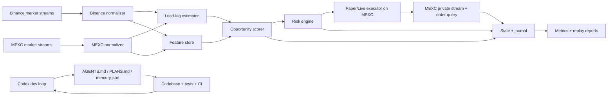
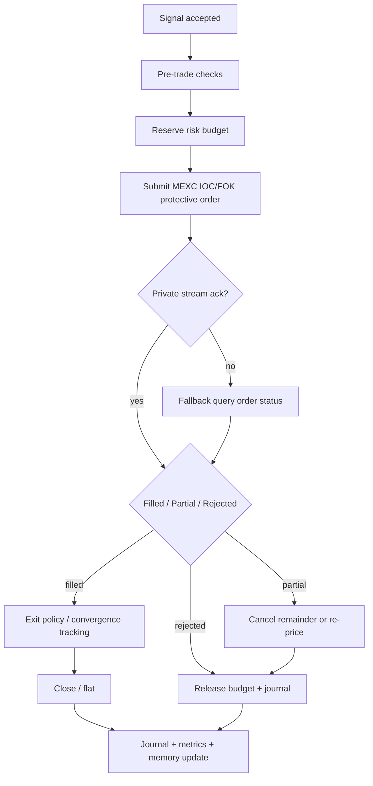

# Как сделать Codex максимально эффективным для автоматизации Binance→MEXC lead-lag арбитража

## Executive summary

Для этого проекта лучший подход — использовать Codex не как часть торгового цикла, а как **инженерный контур управления разработкой**: он должен читать репозиторий, поддерживать единые правила через `AGENTS.md`, работать по самодостаточному `PLANS.md`, вносить маленькие изменения, запускать проверки, обновлять артефакты состояния и делать self-review. Для самых сложных задач в Codex сейчас рекомендуется `gpt-5.5`, а если он недоступен в аккаунте — `gpt-5.4`; для автоматизации и CI корректный режим — `codex exec`, а не длинные интерактивные треды без артефактов в репозитории. citeturn22view4turn10search5turn22view3turn19view4turn9view0turn26view0

Для самой стратегии критично другое: **LLM не должен участвовать в live-path сигнала или исполнения**. Low-latency контур должен быть детерминированным, событийным и написан обычным кодом: публичные потоки рынка от urlBinance Spot APIturn14search8 как signal market, публичные и приватные API urlMEXC Spot V3 APIturn17search0 как execution market, локальные копии стаканов, отдельный модуль измерения лага, отдельный risk engine и отдельный layer paper/replay. Это особенно важно потому, что у MEXC в официальных материалах прямо указано отсутствие тестовой среды, тогда как у Binance есть Spot Testnet и Demo Mode; значит, основной испытательный стенд должен быть **внутренним replay/paper-движком**, а не надеждой на биржевой sandbox. citeturn28view0turn28view1turn15view4turn15view5

Самая частая архитектурная ошибка в таких системах — **жестко прибить “Binance всегда лидер, MEXC всегда лаггер” для всех монет**. Исследования по microstructure и crypto price discovery показывают, что lead-lag эффекты реально существуют, но они зависят от ликвидности, активности, глубины, imbalance и режима рынка; поэтому лидерство надо оценивать **динамически по символу и окну времени**, а не верить в него априори. citeturn29view3turn29view4turn29view2turn29view1

Если цель — чтобы Codex “не забывал”, “не плодил мусор”, “строго держал структуру” и “сам гонял тесты”, то минимальный обязательный набор такой: корневой `AGENTS.md`; `.agent/PLANS.md`; компактный `memory/memory.json` как canonical current state; `memory/notes.md` как human-readable решения; append-only `logs/*.jsonl`; жесткий read/write protocol; idempotent task prompts; обязательные acceptance criteria; и CI, который верифицирует не только unit/integration tests, но и replay-прибыльность, latency-metrics, деградацию signal quality и корректность работы risk-контуров. citeturn9view0turn26view0turn22view1turn19view3turn19view5turn19view2

## Цели, ограничения и допущения

Приоритизация здесь должна быть не “сначала побольше сигналов”, а наоборот: **сначала воспроизводимость и безопасность, потом сигнал, потом live**. Логика Codex best practices ровно такая же: сначала задать явный contract “что такое done”, где лежат инструкции, какие команды доказывают прогресс, и какие проверки обязательны после изменения. Для биржевого контура это дополнительно подкрепляется тем, что на обеих площадках есть жесткие rate limits, 24-часовые ограничения по WebSocket-сессиям и требования к корректному ведению локальной книги ордеров; архитектурная небрежность здесь быстро превращается в фальшивые сигналы и execution drift. citeturn19view4turn9view5turn32view1turn13view9turn31view0turn31view3

| Приоритет | Цель | Критерий done |
|---|---|---|
| P0 | Репозиторий как источник истины | Codex всегда начинает с `AGENTS.md`, `PLANS.md`, `memory.json`; все изменения воспроизводимы |
| P1 | Корректный paper/replay-контур | Один и тот же market replay дает одинаковые результаты при повторном запуске |
| P2 | Качественный coin selection | Universe строится автоматически, а лидерство в паре валидируется статистически |
| P3 | Безопасное исполнение на MEXC | Есть pre-trade checks, order reconciliation, kill-switch и лимиты |
| P4 | Автоматизированная валидация | Тесты и replay-метрики идут в CI/CD и блокируют деградацию |

Ниже — допущения, потому что пользовательские параметры не зафиксированы и их нельзя честно выдумывать:

- Предположение: речь идет о **spot Binance → spot MEXC**, где Binance — signal market, а MEXC — execution market.
- Предположение: если на MEXC не включены margin/futures, то базовая версия стратегии должна быть **long-only / flat-only**; полноценная short-side логика — отдельная фаза.
- Предположение: quote-asset по умолчанию — `USDT`, а universe — пересечение активных spot-symbols на обеих биржах.
- Предположение: точные комиссии, VIP tier, размер символов, target holding time, допустимый риск на сделку, хостинг и география сервера не заданы; значит, они должны попасть в `config/runtime.yaml` как явные параметры.
- Предположение: под “OpenAI Codex 5.5” имеется в виду current Codex workflow на модели `gpt-5.5`; если в аккаунте она недоступна, используется `gpt-5.4`. citeturn22view4turn10search5

По ограничениям платформ есть несколько важных фактов. У urlBinance APIturn28view1 есть Spot Testnet и Demo Mode, а testnet в целом повторяет live-ограничения по symbol filters и rate limits; у urlMEXC API на русскомturn28view0 прямо написано, что публичной тестовой среды нет. У Binance повторные нарушения rate limits могут довести до IP ban с `418` и `Retry-After`; у MEXC `429` означает rate limit, а `5XX` трактуются как “execution status is unknown”, то есть после такого ответа нельзя просто считать ордер неисполненным. citeturn14search5turn15view4turn15view3turn13view7

## Архитектура и структура проекта

Рекомендованная архитектура — **тонкие биржевые адаптеры + детерминированное сигнальное ядро + раздельный state/journal layer + отдельный контур разработки Codex**. Это хорошо совпадает с тем, как Codex документирован официально: repository guidance живет в `AGENTS.md`, project behavior — в `.codex/config.toml`, повторяемые workflow — в skills, а специализированные задачи можно разделить на узкие subagents. citeturn9view0turn9view3turn22view1turn22view0



В low-latency data path оптимальный источник для Binance — public WebSocket streams: real-time `bookTicker` или depth streams, плюс алгоритм ведения локального стакана из официальной инструкции “How to manage a local order book correctly”. Для MEXC — public market WebSocket, diff-depth + snapshot bootstrap по официальной инструкции “How to Properly Maintain a Local Copy of the Order Book”. Оба провайдера ограничивают жизненный цикл соединений примерно 24 часами, что должно быть встроено в reconnect-controller как нормальное, а не аварийное событие. citeturn32view1turn32view2turn13view9turn31view0turn31view3

### Предлагаемая структура репозитория

| Путь | Назначение |
|---|---|
| `AGENTS.md` | Главный contract для Codex: как читать проект, как запускать тесты, что значит done |
| `.agent/PLANS.md` | Шаблон длинных self-contained ExecPlans |
| `.codex/config.toml` | project-level Codex config: model, sandbox, approval policy, trusted roots |
| `.codex/agents/reviewer.toml` | read-only reviewer, ищет correctness/security/test gaps |
| `.codex/agents/docs_researcher.toml` | read-only агент для проверки API-контрактов |
| `.codex/agents/replay_tester.toml` | агент для запуска replay/sim regression |
| `.codex/skills/paper_trading_gate/` | skill для обязательного replay before merge |
| `src/adapters/binance_market.py` | публичные market-streams и snapshots Binance |
| `src/adapters/mexc_market.py` | публичные market-streams и snapshots MEXC |
| `src/adapters/mexc_trading.py` | MEXC order/test/query/openOrders/private stream |
| `src/core/types.py` | канонические dataclasses/Protocol/Enums |
| `src/core/orderbook.py` | локальная книга ордеров и bootstrap logic |
| `src/core/clock.py` | server-time sync, monotonic receive timestamps, skew tracking |
| `src/discovery/universe.py` | пересечение symbols, status, filters, liquidity ranking |
| `src/signals/leadlag.py` | лаг-оценка, cross-correlation, lag stability, leader score |
| `src/signals/opportunity.py` | edge calculation, thresholds, regime gates |
| `src/execution/router.py` | единый интерфейс paper/live submit/cancel/reconcile |
| `src/risk/limits.py` | caps, kill-switch, max age, feed health gating |
| `src/state/memory_store.py` | read/write `memory.json`, snapshots, pruning |
| `src/state/journal.py` | append-only jsonl events |
| `src/backtest/replay.py` | детерминированный event replay |
| `src/backtest/fill_model.py` | pessimistic fill/slippage/latency model |
| `src/metrics/monitoring.py` | PnL, fill ratio, lag, stale-feed, reject-rate |
| `app/main.py` | orchestration entrypoint |
| `memory/memory.json` | compact canonical current state |
| `memory/notes.md` | human-readable решения и текущее понимание |
| `logs/` | ежедневные `jsonl` логи |
| `reports/` | test reports, replay metrics, Codex handoffs |
| `tests/unit/` | unit tests |
| `tests/integration/` | exchange adapters, signing, WS bootstrap |
| `tests/e2e/` | end-to-end сценарии paper/live-mock |
| `tests/replay/` | replay regression и statistical guardrails |

### Потоки данных и API-границы

На discovery-фазе система должна брать symbol metadata из `exchangeInfo`, статус symbol’ов, filters, account UID и user-specific commissions, а также списки offline/suspended instruments. На Binance для market data достаточно public endpoints/streams; для MEXC исполнение и приватные обновления требуют signed endpoints и user data stream. На Binance `GET /api/v3/account` теперь включает `uid`, а на MEXC есть отдельный `GET /api/v3/uid`; у MEXC часть лимитов специально разделяется на IP-based и UID-based buckets. Это делает `uid` хорошим **идентификатором аккаунтного namespace**, но не authentication artifact. citeturn13view3turn13view0turn13view2turn23search1turn23search0

`u_id`/`uid` я рекомендую использовать так:

- `account_namespace = "{strategy_instance_id}:{binance_uid}:{mexc_uid}"`;
- префикс для файлов состояния, replay-артефактов и order correlation keys;
- партиционирование rate-limit telemetry, чтобы в multi-account setup не смешивать события;
- аудит и журналирование по аккаунтам;
- но **никогда** не использовать `uid` как секрет, токен или substitute for API key. citeturn13view3turn13view0turn13view2

### Безопасность ключей и доверенная зона Codex

Секреты должны жить **вне репозитория**: в environment variables, системном secret store или CI secrets. В самом workspace Codex лучше запрещать чтение `*.env` и похожих файлов через filesystem policy; официальная документация прямо показывает такой способ deny-reads для чувствительных путей. На Binance разумно развести ключи: отдельный `TRADE` ключ для live execution и отдельный `USER_DATA` ключ для мониторинга/отчетности; по умолчанию Binance trade permission не включен. На MEXC надо обязательно ставить IP restrictions и ограничивать доступные trading pairs; в FAQ также указано, что ключ без привязанного IP имеет срок жизни 90 дней, а на один ключ можно повесить до 10 IP. В CI все секреты должны идти через secrets-context, а нестандартные чувствительные значения — дополнительно маскироваться `::add-mask::`. citeturn9view2turn15view1turn17search0turn4search18turn11search0turn11search7

## Память, протокол Codex и вспомогательные файлы

Если нужна “память, которая не забывается”, то ее нужно делать **внешней и файловой**. Официальные Codex-guides ровно на это и подталкивают: постоянные инструкции в `AGENTS.md`, project-specific config в `.codex/config.toml`, long-running work через `PLANS.md`/ExecPlan, skills как reusable workflow, причем и инструкции `AGENTS.md`, и список skills имеют ограниченный context budget. Из этого следует практическое правило: `memory.json` должен быть компактным, каноническим и машинно-читаемым, а длинная история уходит в `notes.md`, `reports/` и `logs/*.jsonl`. citeturn9view0turn26view0turn22view1turn25search13

### Вспомогательные файлы, которые Codex должен читать первым

| Файл | Роль | Жесткое правило |
|---|---|---|
| `AGENTS.md` | invariant rules | Читать первым в любой новой сессии |
| `.agent/PLANS.md` | шаблон многошаговой работы | Любая большая задача обязана иметь self-contained plan |
| `memory/memory.json` | текущее машинное состояние проекта | Обновляется после каждого значимого milestone |
| `memory/notes.md` | human notes / rationale | Коротко фиксирует решения и спорные места |
| `reports/latest_test_report.md` | последняя валидация | Любой patch без обновленного отчета считается незавершенным |
| `reports/current_execplan.md` | активный plan на текущую фичу | Источник истины для incremental work |

### Принципы `memory.json`

Рекомендую следующий design:

- хранить только **текущее состояние**, не полную историю;
- не хранить secrets, bearer tokens, raw private payloads;
- version every schema;
- иметь section `assumptions`, чтобы Codex не выдумывал параметры заново;
- хранить короткий “what changed last” и “what blocks next”, а не роман на тысячи строк;
- все тяжелые event logs — только в `logs/*.jsonl`;
- snapshots — на graceful shutdown, перед migration и перед nightly replay. citeturn26view0turn19view3turn19view5

Пример `memory/memory.json`:

```json
{
  "schema_version": "1.0.0",
  "updated_at_utc": "2026-05-13T10:30:00Z",
  "strategy_instance_id": "binance_mexc_leadlag_spot_v1",
  "account_namespace": {
    "binance_uid": "123456789",
    "mexc_uid": "209302839",
    "mode": "paper"
  },
  "secret_refs": {
    "binance_api_key": "env:BINANCE_API_KEY",
    "binance_api_secret": "env:BINANCE_API_SECRET",
    "mexc_api_key": "env:MEXC_API_KEY",
    "mexc_api_secret": "env:MEXC_API_SECRET"
  },
  "assumptions": {
    "quote_asset": "USDT",
    "execution_side_mode": "long_only",
    "live_trading_enabled": false,
    "fee_source": "exchange_api"
  },
  "runtime": {
    "last_boot_utc": "2026-05-13T10:00:00Z",
    "last_execplan": "reports/current_execplan.md",
    "last_test_report": "reports/latest_test_report.md",
    "last_replay_report": "reports/replay_2026-05-13.md"
  },
  "health": {
    "binance_ws": "healthy",
    "mexc_ws": "healthy",
    "mexc_user_stream": "healthy",
    "clock_sync": "healthy",
    "risk_state": "green"
  },
  "symbol_state": {
    "BTCUSDT": {
      "enabled": true,
      "leader_score": 0.91,
      "lag_p50_ms": 145,
      "lag_p95_ms": 310,
      "trade_rate_per_sec": 42.8,
      "spread_bps_median": 1.7,
      "depth_ratio": 3.4,
      "last_signal_utc": "2026-05-13T10:28:58Z"
    }
  },
  "positions": [],
  "open_orders": [],
  "recent_errors": [
    {
      "ts": "2026-05-13T10:20:11Z",
      "source": "mexc_trading",
      "code": "HTTP_429",
      "handled": true
    }
  ],
  "codex_progress": {
    "current_goal": "Implement replay regression gates",
    "last_completed_milestone": "M2",
    "next_required_step": "Add latency fault-injection tests",
    "do_not_repeat": [
      "Do not create duplicate replay fixtures",
      "Do not store secrets in memory.json"
    ]
  },
  "retention": {
    "max_recent_errors": 100,
    "max_symbol_entries": 500,
    "prune_stale_symbol_after_days": 14
  }
}
```

### `memory_utils.py`

Ниже — минимальный кодовый каркас, который делает `memory.json` атомарным, версионируемым и пригодным для idempotent-updates; именно такой небольшой canonical-state и нужен, если вы не хотите, чтобы Codex снова и снова “вспоминал проект с нуля”. citeturn26view0turn9view0turn22view1

```python
# src/state/memory_utils.py
from __future__ import annotations

import json
import tempfile
from copy import deepcopy
from datetime import datetime, timezone
from pathlib import Path
from typing import Any, Callable

SCHEMA_VERSION = "1.0.0"


def utc_now_iso() -> str:
    return datetime.now(timezone.utc).replace(microsecond=0).isoformat().replace("+00:00", "Z")


def default_memory(
    strategy_instance_id: str,
    binance_uid: str,
    mexc_uid: str,
    mode: str = "paper",
) -> dict[str, Any]:
    return {
        "schema_version": SCHEMA_VERSION,
        "updated_at_utc": utc_now_iso(),
        "strategy_instance_id": strategy_instance_id,
        "account_namespace": {
            "binance_uid": binance_uid,
            "mexc_uid": mexc_uid,
            "mode": mode,
        },
        "secret_refs": {},
        "assumptions": {},
        "runtime": {},
        "health": {},
        "symbol_state": {},
        "positions": [],
        "open_orders": [],
        "recent_errors": [],
        "codex_progress": {},
        "retention": {
            "max_recent_errors": 100,
            "max_symbol_entries": 500,
            "prune_stale_symbol_after_days": 14,
        },
    }


def _atomic_write_json(path: Path, payload: dict[str, Any]) -> None:
    path.parent.mkdir(parents=True, exist_ok=True)
    with tempfile.NamedTemporaryFile("w", encoding="utf-8", delete=False, dir=path.parent) as tmp:
        json.dump(payload, tmp, ensure_ascii=False, indent=2, sort_keys=True)
        tmp.flush()
        tmp_path = Path(tmp.name)
    tmp_path.replace(path)


def load_memory(path: str | Path) -> dict[str, Any]:
    p = Path(path)
    if not p.exists():
        raise FileNotFoundError(f"memory file not found: {p}")
    with p.open("r", encoding="utf-8") as fh:
        data = json.load(fh)
    if data.get("schema_version") != SCHEMA_VERSION:
        raise ValueError(
            f"unsupported schema_version={data.get('schema_version')}, expected {SCHEMA_VERSION}"
        )
    return data


def prune_memory(data: dict[str, Any]) -> dict[str, Any]:
    copy_ = deepcopy(data)
    retention = copy_.get("retention", {})
    max_recent_errors = int(retention.get("max_recent_errors", 100))
    max_symbol_entries = int(retention.get("max_symbol_entries", 500))

    recent_errors = copy_.get("recent_errors", [])
    copy_["recent_errors"] = recent_errors[-max_recent_errors:]

    symbol_state = copy_.get("symbol_state", {})
    if len(symbol_state) > max_symbol_entries:
        # Keep most recently signaled symbols first.
        items = sorted(
            symbol_state.items(),
            key=lambda kv: kv[1].get("last_signal_utc", ""),
            reverse=True,
        )[:max_symbol_entries]
        copy_["symbol_state"] = dict(items)

    copy_["updated_at_utc"] = utc_now_iso()
    return copy_


def update_memory(
    path: str | Path,
    mutator: Callable[[dict[str, Any]], dict[str, Any] | None],
) -> dict[str, Any]:
    current = load_memory(path)
    working = deepcopy(current)
    result = mutator(working)
    next_state = working if result is None else result
    next_state = prune_memory(next_state)
    _atomic_write_json(Path(path), next_state)
    return next_state
```

### Правила версионирования, retention и pruning

- `memory.json`: всегда один активный файл на account-namespace; snapshots в `memory/snapshots/YYYY-MM-DD/`.
- `logs/*.jsonl`: ежедневная ротация; старые raw logs сжимать.
- replay artifacts: хранить минимум 30–90 дней, потому что они нужны для statistical regressions.
- `recent_errors`, `last_candidates`, `notes` — всегда capped collections.
- не хранить в памяти сырые L2 event dumps; только pointers на файлы.  

Такой pruning важен не только из-за размера диска, но и из-за того, что Codex guidance/state должны оставаться короткими и обзорными, иначе полезный контекст быстро вытесняется менее важным шумом. citeturn9view0turn22view1

### Протокол взаимодействия с Codex

Для каждой нетривиальной задачи Codex должен следовать одному и тому же read→plan→patch→test→update-state→review циклу. Это напрямую соответствует официальным рекомендациям: Codex надо явно просить писать/обновлять тесты, гонять нужные проверки, подтверждать результат и делать review; для long-running задач полезно задавать one objective, one stopping condition и checkpoints. citeturn19view4turn9view5turn22view3

**Порядок чтения перед любой задачей:**

1. `AGENTS.md`
2. `.agent/PLANS.md`
3. `memory/memory.json`
4. `reports/current_execplan.md` или создать его
5. только потом — целевые модули и тесты

**Порядок записи после любой задачи:**

1. код и тесты  
2. `reports/latest_test_report.md`  
3. `memory/memory.json`  
4. `memory/notes.md`  
5. при крупной задаче — update `reports/current_execplan.md`

**Idempotency rules:**

- один task = один milestone;
- не создавать второй файл, если есть canonical existing file;
- не дублировать fixtures;
- не менять unrelated files;
- order ids и replay ids должны быть детерминированно формируемы из namespace + symbol + ts + nonce.

### Codex-ready prompt templates

Ниже — шаблоны, которые стоит реально положить в `assets/prompts/` и использовать почти без изменений.

#### Bootstrap prompt

```text
Read these files first, in this exact order:
1) AGENTS.md
2) .agent/PLANS.md
3) memory/memory.json
4) reports/current_execplan.md if it exists

Task:
Implement the next smallest milestone for the Binance->MEXC lead-lag paper-trading system.

Hard constraints:
- Keep the existing project structure.
- Do not create duplicate files or alternate implementations.
- Do not store secrets in repo files.
- If assumptions are needed, add them to memory/memory.json and memory/notes.md.
- Edit only files required for this milestone.

Required process:
- Write or update reports/current_execplan.md with the milestone scope and acceptance checks.
- Implement the code.
- Add or update tests.
- Run the exact relevant commands from AGENTS.md.
- Update reports/latest_test_report.md with outputs and pass/fail summary.
- Update memory/memory.json and memory/notes.md.
- Review your own diff for correctness, regressions, missing tests, and security issues.

Definition of done:
- The milestone acceptance checks pass.
- The test report is updated.
- memory/memory.json reflects the new project state.
```

#### Prompt для реализации конкретного модуля

```text
Read AGENTS.md, .agent/PLANS.md, memory/memory.json, and the target module tests first.

Goal:
Implement src/signals/leadlag.py for dynamic leader scoring between Binance and MEXC.

Only do:
- symbol alignment
- event-time lag estimation
- leader_score output
- unit tests

Do not do:
- execution
- risk engine
- UI
- config refactors outside this module cluster

Required validation:
- run unit tests for this module
- run lint/type checks for touched files
- update reports/latest_test_report.md
- update memory/memory.json current_goal, last_completed_milestone, next_required_step
```

#### Prompt для repair-loop после падения тестов

```text
Read AGENTS.md, memory/memory.json, reports/latest_test_report.md, and only the failing test files plus touched implementation files.

Goal:
Fix the current failing tests without broad refactors.

Rules:
- Preserve public interfaces unless tests prove the interface is wrong.
- Prefer the smallest defensible patch.
- If a failure reveals a bad assumption, record it in memory/notes.md.
- Re-run only the failing tests first, then the broader relevant suite.
- After fixes, update reports/latest_test_report.md and memory/memory.json.
- End with a short self-review listing remaining risks.
```

## Алгоритмы, исполнение и риск-контур

Рыночная часть должна строиться вокруг идеи **dynamic empirical leadership**, а не статичного “Binance ведет все”. Исследования в market microstructure показывают, что trade prices и order book imbalance ведущего рынка действительно могут предсказывать future midpoint другого рынка/инструмента; в crypto price discovery centralized venues часто оказываются лидерами, но это лидерство зависит от ликвидности и режима рынка. Поэтому правильная реализация — это адаптивный symbol scorer, а не список “волшебных монет”. citeturn29view3turn29view4turn29view2

### Приоритетный стек алгоритмов

| Вариант | Что делает | Когда использовать |
|---|---|---|
| Rule-based base model | Лаг-оценка + net-edge + liquidity/risk gates | Стартовая production-версия |
| Adaptive statistical model | Rolling robust thresholds, regime segmentation, leader stability | После стабилизации replay-data |
| ML ranking overlay | Ранжирует уже допущенные сигналы, не заменяя базовые фильтры | Только после большой replay-истории |

Практически я бы делал так:

### Отбор монет

Universe должен строиться автоматически как пересечение **активных spot-symbols** на обеих площадках. На MEXC надо удалять offline/suspended instruments; на обеих биржах нужно учитывать `exchangeInfo`/filters и статусы. Внутри пересечения отбор должен идти не только по “24h volume”, а прежде всего по **реализованным rolling microstructure-метрикам**: trade-rate, median spread, depth within X bps, fillable notionals, volatility burst frequency и feed staleness. Это лучше соответствует реальной природе lead-lag execution, чем грубая витринная ликвидность. citeturn24search16turn24search6turn13view4turn4search2turn29view1

Полезный ranking-score для `universe.py`:

```text
score =
  w1 * normalized_quote_turnover_5m
+ w2 * trade_rate_per_sec
+ w3 * depth_at_5bps_ratio
- w4 * spread_bps_median
- w5 * volatility_shock_z
- w6 * stale_event_ratio
+ w7 * leader_stability
```

Где:

- `normalized_quote_turnover_5m` — реальный оборот по trade stream за 5 минут;
- `depth_at_5bps_ratio` — видимая глубина MEXC в 5 bps / target notional;
- `leader_stability` — доля окон, в которых Binance действительно лидировал по оценке лага;
- `stale_event_ratio` — доля событий с возрастом выше допустимого порога.

### Лаг-оценка и сигнал

Для same-coin cross-exchange стратегии ключевой объект — не OHLC-бар, а **event-time midpoint path**. Исследования по lead-lag на tick-by-tick данных прямо подчеркивают, что асинхронные серии нельзя честно сводить к грубым фиксированным интервалам без потери истинной длительности лага; одна из работ по crypto lead-lag показывает, как именно tick-data и asynchronous integration решают эту проблему. У Binance есть опциональная microsecond time support в REST и market streams; это полезно для точного измерения event time. У MEXC timestamping в публичных spot docs остается миллисекундным, поэтому для него надо дополнительно писать local receive timestamp на монотонных часах. citeturn30view0turn24search0turn24search2turn24search1

Базовая логика сигнала:

```text
mid_binance = (best_bid_binance + best_ask_binance) / 2
mid_mexc    = (best_bid_mexc + best_ask_mexc) / 2

ref_move_bps = 1e4 * (mid_binance_now - mid_binance_t0) / mid_binance_t0
pred_move_bps = beta(symbol, regime) * ref_move_bps
imbalance_bonus_bps = gamma * obi_binance

expected_mid_mexc = mid_mexc * (1 + (pred_move_bps + imbalance_bonus_bps) / 1e4)

raw_edge_buy_bps =
  1e4 * (expected_mid_mexc - best_ask_mexc_execable) / mid_mexc

raw_edge_sell_bps =
  1e4 * (best_bid_mexc_execable - expected_mid_mexc) / mid_mexc

edge_net_bps =
  raw_edge_bps
  - fee_bps
  - slippage_p90_bps
  - stale_penalty_bps
  - clock_uncertainty_bps
  - cancel_risk_buffer_bps
```

Где `obi_binance` — order book imbalance на ведущем рынке. Такой feature обоснован исследованиями: imbalance хорошо предсказывает знак следующего market order и immediate price changes, а lead-lag paper по microstructure отдельно показывает предсказательную силу trade prices и imbalance для midpoint behavior. citeturn29view2turn29view3

**Trigger conditions** я бы делал такими:

- `edge_net_bps >= entry_threshold_bps(symbol)`
- `leader_score >= leader_min`
- `lag_p50_ms >= rtt_submit_p95_ms + safety_margin_ms`
- `spread_bps_mexc <= spread_cap_bps`
- `depth_at_3bps >= 1.5 * target_notional`
- `feed_age_ms <= stale_cap_ms`
- `regime != stressed`
- `risk_state == green`

И отдельно — **N-of-M confirmation**: например, 2 подтверждения из последних 3 event frames, чтобы не прыгать на одиночный glitch.

### Order execution logic

На MEXC для latency-style execution лучше использовать не голый market order, а **marketable protective IOC limit**: это ограничивает проскальзывание, но сохраняет агрессивность входа. В spot docs MEXC явно поддерживает `IMMEDIATE_OR_CANCEL`, `FILL_OR_KILL`, `MARKET_ORDER`, `LIMIT_ORDER`; есть и `POST /api/v3/order/test`, который валидирует параметры без отправки в matching engine. У Binance тоже есть `POST /api/v3/order/test`, что полезно для проверок adapter logic и fee estimation, хотя в вашей постановке Binance не используется как execution venue. citeturn4search8turn16search0turn13view8turn23search4turn15view7

Рекомендованный state machine исполнения:



Правила по submit/reconcile:

- `newClientOrderId`/`clientOrderId` обязательно детерминированный и уникальный;
- после submit ждать приватный WS event, но иметь fallback на `GET /api/v3/order`;
- любой `5XX` на MEXC трактовать как **UNKNOWN**, а не как hard failure; после этого идти в reconcile branch;
- частичные исполнения не должны автоматически добиваться по любой цене: нужен re-check `edge_net_bps`;
- если edge схлопнулся, remainder отменяется и позиция входит в defensive exit logic. citeturn13view7turn23search14turn31view0turn31view1

### Риск-контроль

С точки зрения риска это не “чистый арбитраж”, а **очень короткий directional catch-up trade**, пока не добавлен реальный hedge leg. Поэтому risk engine обязан быть жестче, чем кажется на бумаге. Общий academic фон по latency arbitrage и crypto arbitrage показывает, что даже при наличии видимых отклонений рынок сегментирован, а frictions, price impact и limits to arbitrage реальны; кроме того, latency races очень чувствительны к инфраструктурной скорости. citeturn29view0turn29view1

Я бы сделал следующие hard limits:

| Контроль | Условие срабатывания | Действие |
|---|---|---|
| Feed stale kill | Binance или MEXC feed age > cap | запрет новых входов |
| Orderbook desync kill | depth stream потерял continuity | немедленный resync, без торговли |
| Clock skew kill | server/local drift выше лимита | блок входов до выравнивания |
| Rate-limit pressure | рост 429/ban-risk | замедление, затем kill |
| Position age cap | позиция живет дольше ожидаемого catch-up window | принудительный exit |
| Symbol exposure cap | notional/symbol выше лимита | запрет добавления |
| Account exposure cap | суммарный риск выше лимита | global block |
| Consecutive error cap | N unknown/reject/timeout подряд | strategy halt |
| Daily loss cap | realized PnL < threshold | kill until manual reset |
| Signal decay gate | edge_net_bps исчез до exec | cancel / no re-entry |

### Backtesting и paper-trading framework

Поскольку у MEXC нет тестовой среды, production-like validation должна строиться на **собственном deterministic replay**. Это значит:

1. сохранять raw public events от Binance и MEXC с local receive timestamps;  
2. сохранять snapshot boundaries и health events;  
3. в replay воспроизводить не только цену, но и **латентность**, видимость стакана, частичные fill’ы, пропуски пакетов и reconnects;  
4. paper executor должен использовать pessimistic fill model, а не “идеальную сделку по лучшему ask/bid”. citeturn28view0turn32view1turn13view9

Минимальный набор replay-метрик:

- `signal_count`
- `gross_edge_bps_avg`
- `net_edge_bps_avg`
- `fill_ratio`
- `partial_fill_ratio`
- `median_time_to_fill_ms`
- `median_time_to_convergence_ms`
- `max_adverse_excursion_bps`
- `p50/p95/p99 observed_lag_ms`
- `stale_feed_incidents`
- `orderbook_resync_count`
- `api_error_rate`
- `rate_limit_events`
- `realized_pnl_bps`
- `replay_vs_paper_drift`

### `main` orchestration flow

Ниже — минимальный Codex-ready каркас main-loop; он отделяет discovery, signal, risk, execution и state update, а значит легче тестируется и лучше подходит под маленькие milestone-патчи. citeturn19view4turn22view0turn22view3

```python
# app/main.py
from __future__ import annotations

import asyncio
from dataclasses import dataclass
from typing import Protocol, Iterable, Any


class UniverseScanner(Protocol):
    async def scan(self) -> Iterable[str]: ...


class MarketView(Protocol):
    def snapshot(self, symbol: str) -> dict[str, Any] | None: ...


class SignalEngine(Protocol):
    def evaluate(self, symbol: str, b: dict[str, Any], m: dict[str, Any]) -> dict[str, Any] | None: ...


class RiskEngine(Protocol):
    def can_open(self, signal: dict[str, Any]) -> tuple[bool, str]: ...
    def register(self, signal: dict[str, Any]) -> None: ...


class Executor(Protocol):
    async def submit(self, signal: dict[str, Any]) -> dict[str, Any]: ...


class MemoryStore(Protocol):
    async def record_cycle(self, summary: dict[str, Any]) -> None: ...
    async def record_trade(self, trade_event: dict[str, Any]) -> None: ...


@dataclass
class AppContext:
    universe: UniverseScanner
    binance_market: MarketView
    mexc_market: MarketView
    signals: SignalEngine
    risk: RiskEngine
    executor: Executor
    memory: MemoryStore


async def run_once(ctx: AppContext) -> None:
    cycle_summary: dict[str, Any] = {
        "symbols_seen": 0,
        "signals_considered": 0,
        "signals_submitted": 0,
        "skips": [],
    }

    for symbol in await _materialize(ctx.universe.scan()):
        cycle_summary["symbols_seen"] += 1

        b = ctx.binance_market.snapshot(symbol)
        m = ctx.mexc_market.snapshot(symbol)
        if not b or not m:
            cycle_summary["skips"].append({"symbol": symbol, "reason": "missing_snapshot"})
            continue

        signal = ctx.signals.evaluate(symbol, b, m)
        if signal is None:
            continue

        cycle_summary["signals_considered"] += 1
        allowed, reason = ctx.risk.can_open(signal)
        if not allowed:
            cycle_summary["skips"].append({"symbol": symbol, "reason": reason})
            continue

        ctx.risk.register(signal)
        trade_event = await ctx.executor.submit(signal)
        cycle_summary["signals_submitted"] += 1
        await ctx.memory.record_trade(trade_event)

    await ctx.memory.record_cycle(cycle_summary)


async def _materialize(items: Iterable[str] | Any) -> list[str]:
    if hasattr(items, "__aiter__"):
        out: list[str] = []
        async for item in items:
            out.append(item)
        return out
    return list(items)


async def main(ctx: AppContext, interval_sec: float = 0.25) -> None:
    while True:
        try:
            await run_once(ctx)
        except Exception as exc:  # replace with structured logging + kill-switch integration
            await ctx.memory.record_cycle({"fatal_loop_error": repr(exc)})
        await asyncio.sleep(interval_sec)
```

## Тестирование, валидация и CI/CD

Для этого проекта тестирование должно быть таким же “первоклассным объектом”, как signal engine. В официальных best practices для Codex прямо сказано: просите его создавать/обновлять тесты, запускать релевантные suites, проверять lint/type checks, подтверждать конечное поведение и делать review diff’а; кроме того, `codex exec` специально предназначен для скриптов и CI. Есть и свежий материал OpenAI про iterative repair loops и eval-driven improvement flywheel: output → validation → feedback → next pass. Это идеально ложится на ваш use case. citeturn19view4turn22view3turn19view0turn19view1turn19view3

### Дизайн test suite

| Слой | Что тестирует | Что не должен тестировать |
|---|---|---|
| Unit | чистые функции, schema migration, threshold math, pruning | биржевые сети |
| Integration | signing, UID fetch, local book bootstrap, order query fallback | прибыльность стратегии |
| E2E | полный signal→risk→paper-exec→journal flow | реальную live-ликвидность |
| Replay regression | стабильность historical edge/PnL/latency | изменение реальных биржевых условий на сегодня |
| Market simulation | packet loss, stale feed, desync, 429/5xx, partial fills | production secrets |

### Примеры тест-кейсов

| Тест | Вход | Ожидаемый результат |
|---|---|---|
| `test_symbol_intersection_filters_offline_pairs` | symbol есть на обеих биржах, но offline на MEXC | symbol исключен |
| `test_leader_score_requires_stable_positive_lag` | шумный лидер с частой сменой знака | signal запрещен |
| `test_edge_below_total_cost_is_rejected` | raw edge < fees + slippage + buffers | входа нет |
| `test_stale_binance_feed_blocks_signal` | age Binance snapshot > cap | входа нет |
| `test_mexc_unknown_status_forces_reconcile` | submit вернул 5xx | переход в `UNKNOWN` и `query_order` |
| `test_orderbook_resync_after_gap` | depth update пропустил sequence | локальная книга пересобирается |
| `test_memory_pruning_caps_recent_errors` | >100 ошибок | в памяти остается cap |
| `test_idempotent_rerun_does_not_duplicate_reports` | повторный запуск того же milestone | нет duplicate artifacts |

### `logger.py`

Структурированный логгер нужен не ради красоты, а потому что replay, CI и Codex-review лучше работают с `jsonl`, чем с “человеческим” красиво отформатированным текстом. Отдельно важно зашить primitive redaction, чтобы случайно не протащить чувствительные значения в artifacts и terminal logs. Это согласуется и с биржевой operational hygiene, и с рекомендациями по маскированию секретов в CI. citeturn11search0turn11search7turn19view2

```python
# src/common/logger.py
from __future__ import annotations

import json
import logging
import re
import sys
from datetime import datetime, timezone
from pathlib import Path
from typing import Any

_SECRET_PATTERNS = [
    re.compile(r'(?i)(api[_-]?key|secret|token|signature)'),
]

def _utc_now() -> str:
    return datetime.now(timezone.utc).isoformat().replace("+00:00", "Z")


def _redact_pairs(payload: dict[str, Any]) -> dict[str, Any]:
    out: dict[str, Any] = {}
    for k, v in payload.items():
        if any(p.search(k) for p in _SECRET_PATTERNS):
            out[k] = "***REDACTED***"
        else:
            out[k] = v
    return out


class JsonFormatter(logging.Formatter):
    def format(self, record: logging.LogRecord) -> str:
        base = {
            "ts": _utc_now(),
            "level": record.levelname,
            "logger": record.name,
            "msg": record.getMessage(),
        }
        extra = getattr(record, "event", None)
        if isinstance(extra, dict):
            base["event"] = _redact_pairs(extra)
        if record.exc_info:
            base["exc_info"] = self.formatException(record.exc_info)
        return json.dumps(base, ensure_ascii=False)


def build_logger(name: str, logfile: str | Path = "logs/app.jsonl") -> logging.Logger:
    logger = logging.getLogger(name)
    logger.setLevel(logging.INFO)
    logger.handlers.clear()
    logger.propagate = False

    formatter = JsonFormatter()

    sh = logging.StreamHandler(sys.stdout)
    sh.setFormatter(formatter)
    logger.addHandler(sh)

    path = Path(logfile)
    path.parent.mkdir(parents=True, exist_ok=True)
    fh = logging.FileHandler(path, encoding="utf-8")
    fh.setFormatter(formatter)
    logger.addHandler(fh)

    return logger


def log_event(logger: logging.Logger, level: int, msg: str, **event: Any) -> None:
    logger.log(level, msg, extra={"event": event})
```

### Метрики, которые нужно мониторить постоянно

Мониторинг должен смотреть не только на PnL, но и на качество execution path. Для latency-style стратегии на практике важнее всего:

- `lag_ms_p50/p95/p99` по символу;
- `signal_to_submit_ms`;
- `submit_to_ack_ms`;
- `submit_to_fill_ms`;
- `fill_ratio`, `partial_fill_ratio`, `reject_ratio`;
- realized slippage vs model slippage;
- `feed_stale_count`;
- `book_resync_count`;
- `429_count`, `418_count`, `5xx_unknown_count`;
- `position_age_ms`;
- `gross_edge_bps` vs `net_realized_bps`;
- `max_adverse_excursion_bps` и `max_favorable_excursion_bps`.  

These are the metrics that actually tell you whether the strategy is alive, drifting, overfitting replay, or being silently killed by infra friction. citeturn29view0turn29view1turn13view7turn15view3

### CI/CD

Наиболее прямолинейный вариант — CI/CD на базе urlGitHub Actionsturn11search14. Официальная документация покрывает reusable workflows, matrix jobs, cron-based `schedule`, artifacts и secrets. Для такого проекта я бы развел пайплайны так:

- **PR pipeline**: `ruff`/`mypy`/unit tests/fast integration tests/short replay smoke.  
- **Protected integration pipeline**: публичные market API tests, signing tests, MEXC `order/test`, user-stream handling, no live orders.  
- **Nightly replay pipeline**: длинный replay по capture-датасетам, обновление regression-metrics, upload artifacts.  
- **Weekly hardening pipeline**: fault-injection sim, schema migration, memory pruning, chaos packets. citeturn11search1turn11search2turn11search3turn11search5turn11search22

Внутри CI:

- exchange secrets — только через `secrets`/environment secrets;
- все не-secrets, которые могут оказаться чувствительными, маскировать через `::add-mask::`;
- artifacts загружать обязательно: `latest_test_report.md`, replay metrics, failed-case fixtures, summarized logs;
- scheduled runs использовать для regression-drift;
- Codex review можно добавить отдельным шагом на PR или запускать в headless mode в isolated runner. citeturn11search0turn11search3turn19view2turn19view6turn22view3

Практически это означает, что Codex получает не “свободный чат”, а строгий автоматизируемый контракт:

1. прочитать правила;
2. реализовать только milestone;
3. запустить обязательные команды;
4. обновить state/report artifacts;
5. пройти reviewer-pass;
6. лишь потом считать работу законченной.  

Именно в такой постановке он обычно начинает работать “без мусора”, а не как генератор случайных файлов. citeturn19view4turn9view5turn22view0turn26view0

## Рекомендуемые источники

Для инженерной части и ежедневной работы основными источниками должны быть:

- urlOpenAI Codex docsturn10search14
- urlCodex best practicesturn19view4
- urlCustom instructions with AGENTS.mdturn9view0
- urlNon-interactive mode with codex execturn22view3
- urlCodex modelsturn22view4
- urlCodex skillsturn22view1
- urlCodex subagentsturn22view0
- urlCodex Execution Plans and PLANS.mdturn26view0
- urlBinance Spot API docsturn14search8
- urlMEXC Spot V3 API docsturn17search0
- urlGitHub Actions docsturn11search14

Для быстрого русскоязычного онбординга, когда нужно дать человеку “входную дверь”, а не deep contract docs:

- urlOpenAI Codex на русскомturn28view3
- urlПредставляем Codex на русскомturn28view2
- urlBinance API на русскомturn28view1
- urlBinance API FAQ на русскомturn28view4
- urlMEXC API на русскомturn28view0

Для research и калибровки алгоритмов:

- urlQuantifying the High-Frequency Trading Arms Raceturn29view0
- urlTrading and Arbitrage in Cryptocurrency Marketsturn29view1
- urlEnhancing Trading Strategies with Order Book Signalsturn29view2
- urlLead-Lag Relationships in Market Microstructureturn29view3
- urlPrice Discovery in Cryptocurrency Marketsturn29view4
- urlA Tick-by-Tick Level Measurement of the Lead-Lag Duration Between Cryptocurrenciesturn30view0

Итоговая рекомендация проста: **делайте не “бота, который потом как-нибудь доделаем”, а repo-first system, где Codex подчиняется структуре, состояние вынесено в файлы, а вся стратегия проверяется replay- и sim-контуром до live.** Для такого класса задач это дает гораздо больше пользы, чем любые “суперпромпты без архитектуры”. citeturn19view4turn26view0turn19view1turn28view0turn28view1